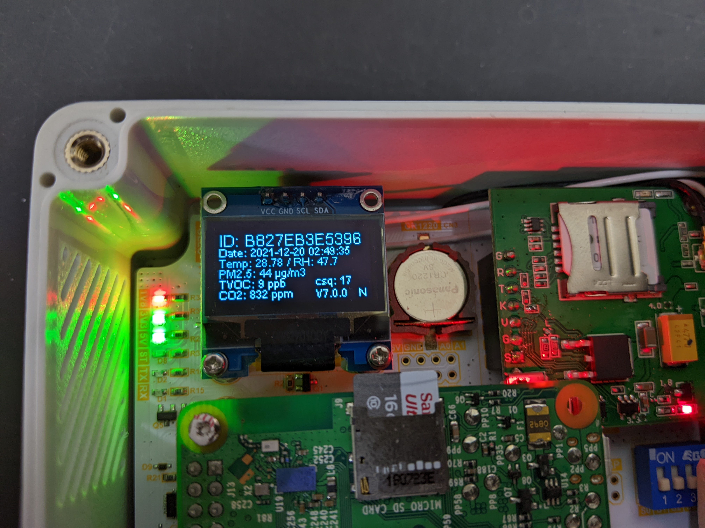
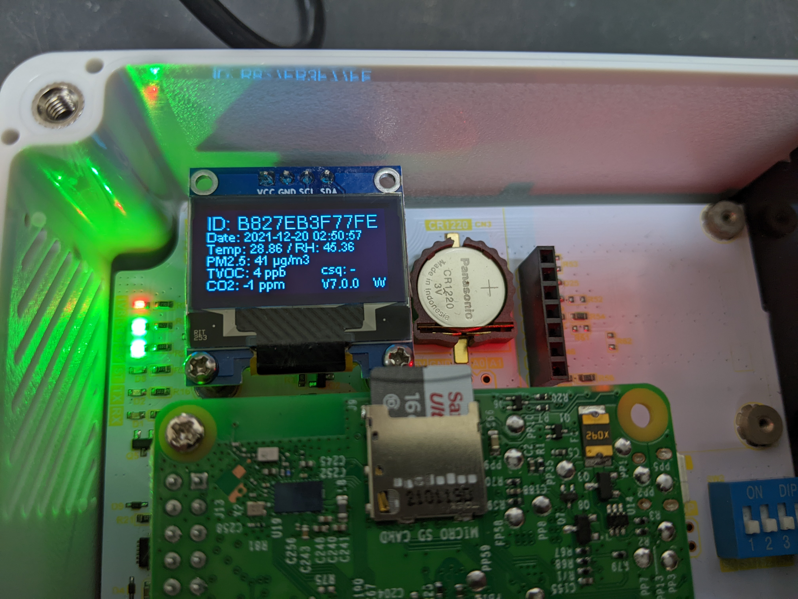
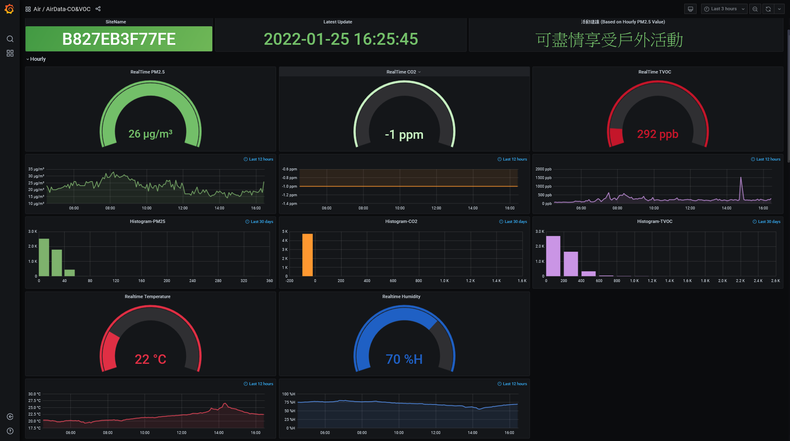

# MAPS6.0 WiFi and NB-IoT Version
此版本依照 [MAPS6_NTU_Special](https://github.com/SCWhite/MAPS6_NTU_Special) 功能大幅重構

## 修改內容
- 新增 NBIoT 模組 SIM7000 Library
- 新增 Simcom 專用 MQTT Library （適用SIM7000、SIM800、SIM7020、AM7020）
- 新增下位機 Mega2560 Library（讀取各感測器資料）
- 移除分貝計相關功能
- 修改主程式流程
- 更新 Raspbian 版本(2021-10-30 armhf-full)
- 與下位機 Mega2560 通訊使用 Hardware Serial(ttyAMA0)
- OLED 加入 NB-IoT 訊號數值（僅在使用NBIoT通訊時顯示，訊號範圍0~31，建議放置在訊號數值大於16的位置）
- OLED 加入顯示網路連接方式（W(Wifi)/N(NBIoT)/-(無網路)）
- 自動判斷通訊方式，優先權 WiFi >> NBIoT
- 連網(WiFi)後自動校正 RTC
- 移除Docker自動更新功能，避免硬碟空間不足導致運作異常

## How To Build maps6_v700 Docker Image
1. Delete old Docker image & container.
2. Clone this repositories.
3. Run docker command.
    - Create Docker Image
        ``` Shell
        docker build -t maps6_v700 . --no-cache
        ```
    - Create Docker Container
        ``` Shell
        docker run -itd --restart unless-stopped \
            --net=host \
            --name maps6-nbiot-wifi \
            --privileged \
            maps6_v700
        ```

## Docker Hub
[zack1999/maps6_v700](https://hub.docker.com/repository/docker/zack1999/maps6_v700)

### 注意事項
- 此版本只適用MAPS6 Firmware version 1.22版以上

# For USER
## WiFi 設定方式
1. 按住MASP6 AP Mode按鈕持續20秒。
2. 使用行動裝置或筆電連接 WiFi MPAS6_V7.0.0 1.2。
3. 開啟瀏覽器輸入IP: 10.0.0.1。
4. 選擇目標WiFi並輸入密碼。
5. 按下確認鍵後等待MAPS6重新啟動即可連接目標WiFi。

## WiFi & NB-IoT 模式
網路使用優先權 WiFi > NB-IoT

- ID：裝置ID
- Date：UTC時間
- Temp：溫度
- RH：濕度
- PM2.5：細懸浮微粒
- TVOC：揮發性有機物
- CO2：二氧化碳
- csq：NBIoT與基地台連接訊號（0~31，建議最低16，推薦20以上）
- Vx.x.x：版本
- 右下角：通訊方式（N：NBIoT, W：WiFi, -：無任何網路連接）



## 雲端資料
- 進入以下網址查看雲端資料（\<device_id\>替換為機器裝置ID）
- 資料上傳頻率：五分鐘一次

https://pm25.lass-net.org/grafana/d/airbox_dashboard2/airdata-coandvoc?orgId=2&var-device_id=<device_id>




## 本地資料
- 資料存放在SD卡內。
- 資料儲存頻率：每分鐘一筆

## GPS
- GPS訊號需要再室外或窗邊才可順利收到

## 其他說明資料
- [MAPSV6-使用完全手冊(中英文)](https://maps6-user-guide.gitbook.io/mapsv6-manual-book-zh/)
- [感測器資料格式](https://maps6-user-guide.gitbook.io/mapsv6-manual-book-zh/zi-liao-ge-shi)
- [PM25 Open Data API](https://app.swaggerhub.com/apis-docs/I2875/PM25_Open_Data/1.0.0)
- [MAPS6_NTU_Special/book](https://github.com/SCWhite/MAPS6_NTU_Special/tree/master/book)


## Lass Server MQTT Protocol Config
- MQTT Broker: 35.162.236.171
- Port : 8883
- MQTT ID: Device ID(MAC)
- Username: maps
- Password: iisnrl
- Topic: MAPS/MAPS6/<Device ID(MAC)>
